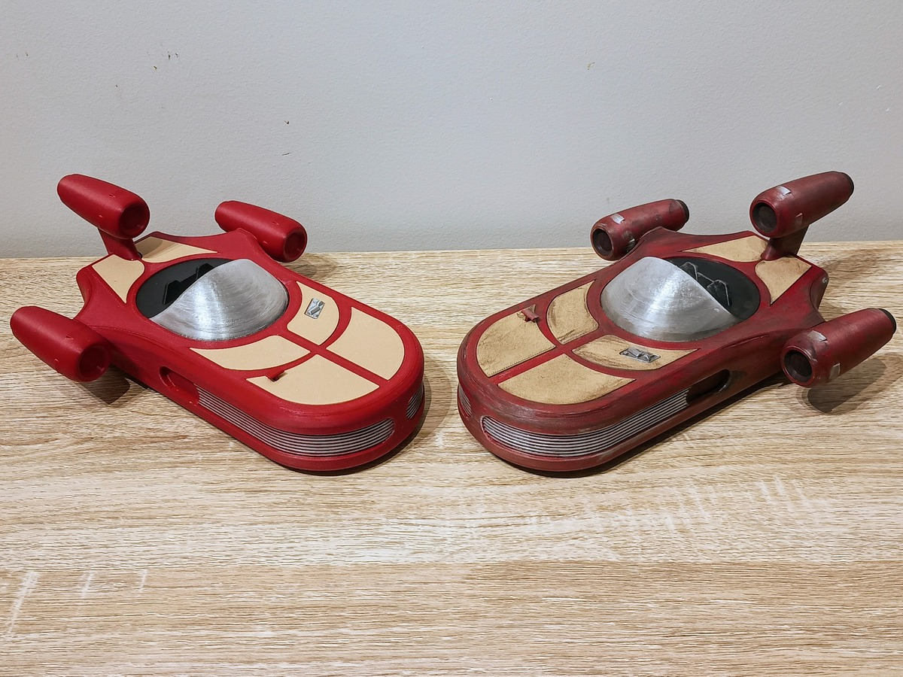

# RC Landspeeder (ESP8266 + RemoteXY)

-blue)

  

Control a Star-Wars-style **RC Landspeeder** with your **phone**.  
Built on a **Wemos/LOLIN D1 mini (ESP8266)** and the **RemoteXY** app running as a Wi-Fi access point — no internet required.

---

## Quick demo

  

---

## TL;DR

1. Open `src/RC_Landspeeder_ESP8266_RemoteXY.ino` in Arduino IDE.  
2. Install **ESP8266** board support; select **LOLIN (WEMOS) D1 R2 & mini**.  
3. Libraries: **RemoteXY (v3.1.13+)** and **Servo** (bundled with ESP8266 core).  
4. Flash, then in RemoteXY choose **Wi-Fi Point** and connect to SSID **`Landspeeder`**, port **6377**.  
5. Controls: **Throttle** slider (−100..100), **Steering** joystick **X** (−100..100).  
6. First power-up: wheels off ground — ESC holds **neutral ~1s** to arm/beep cleanly.

---

## 3D Files (MakerWorld)

Grab the printable parts here:  
**[https://makerworld.com/en/@pumpkin20303](https://makerworld.com/en/models/1711304-luke-skywalker-s-mini-rc-landspeeder#profileId-1815867)**

---

## Hardware

- Wemos/LOLIN **D1 mini (ESP8266)**
- **Car ESC** + motor (per ESC)
- **Steering servo**
- Power via ESC **BEC 5V** or a separate **UBEC** (grounds common)

### Wiring

| Function | ESP8266 Pin | Notes |
|---|---|---|
| Steering servo signal | **D1 (GPIO5)** | ~1500 µs center, ±400 µs travel |
| ESC signal | **D2 (GPIO4)** | 1500 µs neutral; 1000/2000 µs min/max |
| 5V / GND | 5V / G | From ESC BEC or UBEC; **common ground** |

> If the ESP ever reboots under load, add a **470–1000 µF** capacitor at 5V/GND near the D1 mini or use a UBEC.

---

## Software / Build

- Arduino IDE (or Arduino CLI)  
- ESP8266 board package  
- Libraries: **RemoteXY**, **Servo**

**Sketch:** `src/RC_Landspeeder_ESP8266_RemoteXY.ino`

### Config options (edit in the sketch)

- Pins: `STEERING_PIN = D1`, `ESC_PIN = D2`  
- Steering: `SERVO_CENTER_US = 1500`, `SERVO_RANGE_US = 400`  
- ESC: `ESC_MIN_US = 1000`, `ESC_NEUTRAL_US = 1500`, `ESC_MAX_US = 2000`  
- Direction flips: `REVERSE_THR` / `REVERSE_STR`  
- Wi-Fi SSID: `Landspeeder` (set a password if desired)

Key bits:
- **Throttle** = `RemoteXY.Throttle`  
- **Steering** = `RemoteXY.joystick_01_x`  
- Neutral is held on boot and when the app disconnects.

---

## RemoteXY App

- Install the **RemoteXY** mobile app.  
- Connect to **Wi-Fi Point**  
  - **SSID:** `Landspeeder`  
  - **Password:** *(blank unless you changed it)*  
  - **Port:** `6377`  
- The UI is embedded in firmware (`RemoteXY_CONF[]`) and loads automatically.

---

## Troubleshooting

- **Motor spins during beeps / won’t arm:** ESC not seeing neutral or faulty ESC. This sketch holds 1500 µs at boot; try another ESC or invert throttle.  
- **ESP resets under throttle:** BEC sag → add **470–1000 µF** cap or use a **UBEC**.  
- **Steering/throttle reversed:** set `REVERSE_THR` / `REVERSE_STR = true;`  
- **Throw feels off:** tweak `SERVO_RANGE_US` or ESC min/max µs.

---

## Gallery

  

---

## Social Preview

Upload **`landspeeder_social.jpg`** (1280×640) so the repo shows a nice banner when shared:

1. Repo → **Settings → General → Social preview**  
2. **Upload an image** → choose `landspeeder_social.jpg`

---

## License

MIT — see [LICENSE](LICENSE).
